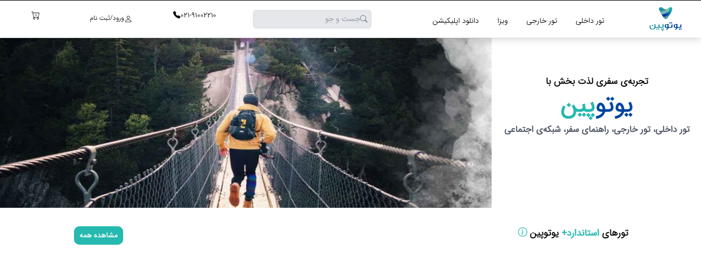

 

<h3 align="center">Youtopin website</h3>

awesome Youtopin website  to  practice projects!
 
 
<a href="https://github.com/rmrady/youtopin"><strong>Explore the docs »</strong></a>

  

 ## About The Project

The Youtopin website is a travel site that is full of beautiful photos and I really liked designing it
 ### Built With

This section should list any major frameworks/libraries used to bootstrap your project. Leave any add-ons/plugins for the acknowledgements section. Here are a few examples.

- [html](https://html.com)
- [css](https://css.com)
- [tailwind](https://tailwindcss.com)
- [javascript](https://javascript.com)
 ## Contact

Your Name -Razieh Moradi (rmrady758@gmail.com)

Project Link: https://github.com/rmrady/youtopin
